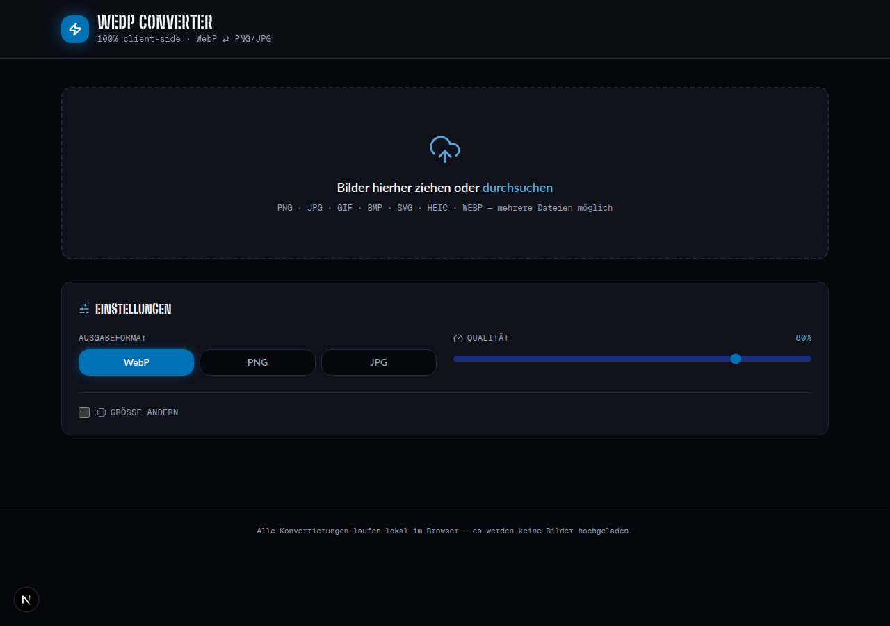
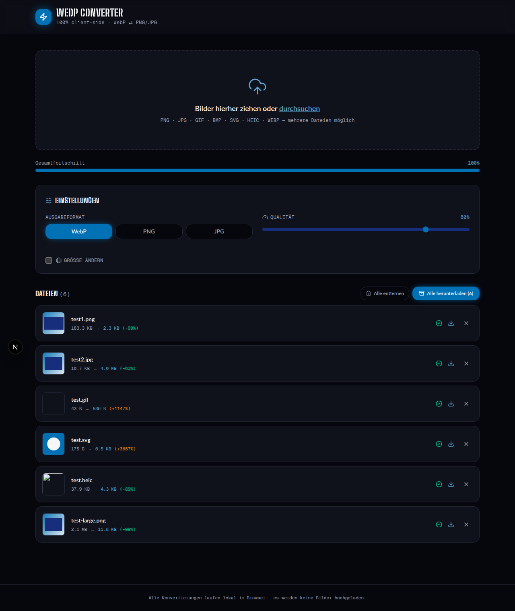
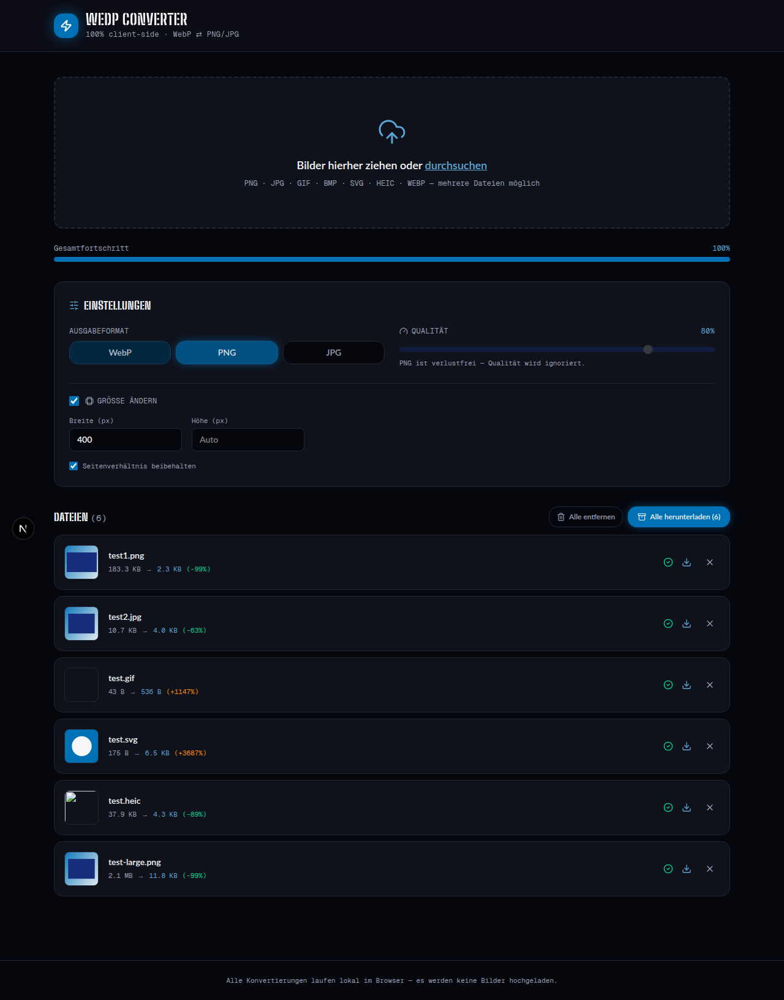
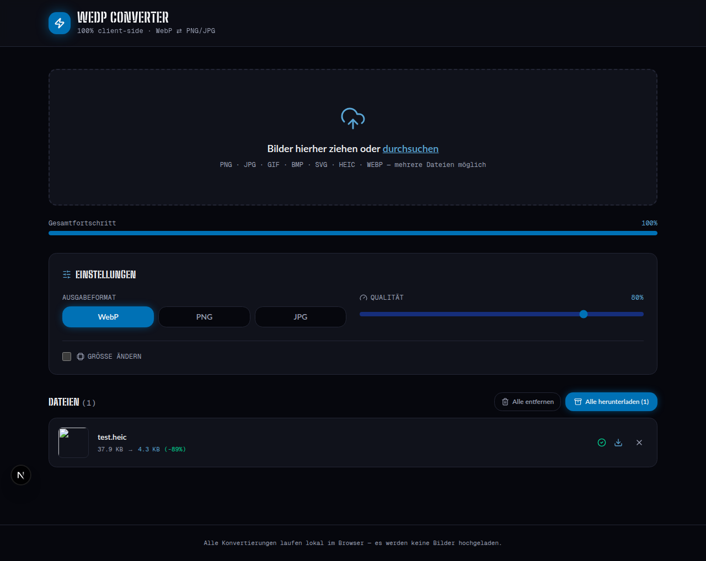

# WEDP Converter

Clientseitiger WebP-Bildkonverter (Next.js 15, App Router, TypeScript, Tailwind v4). Die Bildkonvertierung selbst läuft vollständig im Browser via `OffscreenCanvas` in einem Pool von Web Workern — kein Bild-Upload, keine Serverless-Function dafür nötig. Ein separater, serverseitig geschützter `/admin`-Bereich (Login-System, siehe unten) nutzt Next.js API-Routes.

## Screenshots

| Start | Batch-Konvertierung |
|---|---|
|  |  |

| Einstellungen (Resize + PNG) | HEIC-Konvertierung |
|---|---|
|  |  |

## Features

- Drag-and-Drop-Batch-Upload: PNG, JPG, GIF, BMP, SVG, HEIC/HEIF, WEBP
- Export nach WebP, PNG oder JPG
- Qualitäts-Slider (1–100 %) und optionales Resizing (Seitenverhältnis beibehaltbar)
- Live-Liste mit Thumbnail, Original-/Zielgröße, Ersparnis-%, Status
- Einzel-Download oder ZIP-Sammel-Download (JSZip)

## Entwicklung

```bash
npm install
npm run dev
```

## Deployment

Vercel: Standard-Next.js-Erkennung, keine weitere Konfiguration nötig.

Netlify: `netlify.toml` ist enthalten (`@netlify/plugin-nextjs`, Cache-Header für `_next/static` und `fonts`). `@netlify/plugin-nextjs` wird beim ersten Deploy automatisch installiert.

## Admin-Login (`/admin`)

Rollenbasiertes, serverseitig geschütztes Login-System für einen internen Admin-Bereich, unabhängig von der Bildkonvertierung.

**Ablauf**: Formular (`/admin/login`) → `POST /api/admin/login` → IP-Rate-Limit (5 Versuche/5 Min) → Authentifizierung gegen drei Quellen in Reihenfolge → signiertes HMAC-Session-Token als `httpOnly`/`sameSite=strict`-Cookie (`admin_session`, 8h gültig).

**Drei Benutzer-Quellen** (geprüft in dieser Reihenfolge):
1. **Break-Glass-Admin** — `ADMIN_USER` + `ADMIN_PASSWORD_HASH` (Env-Variablen). Immer verfügbar, höchste Rolle (`superadmin`).
2. **Lokale Benutzer** — `.admin-users.json` im Projekt-Root (git-ignored, wird nicht committed). Unterstützt `mustChangePassword`, um einen Passwort-Reset beim nächsten Login zu erzwingen. Hash generieren: `node scripts/hash-password.mjs "passwort"`.
3. **Remote-Credentials-Repo** *(optional)* — wird nur konsultiert, wenn `CREDENTIALS_REPO_URL` gesetzt ist und der Benutzername in keiner der ersten beiden Quellen existiert. Lädt `credentials.json` aus einem GitHub-Repo über die Contents-API.

**Sicherheit**:
- Passwörter: `scrypt` (Node `node:crypto`), Salt pro Passwort, `timingSafeEqual`-Vergleich.
- Timing-Schutz: Ein unbekannter Benutzername durchläuft eine Dummy-`scrypt`-Berechnung (`burnPasswordVerificationTime`), damit die Antwortzeit keine Rückschlüsse auf existierende Accounts zulässt.
- Session-Tokens: HMAC-SHA256 über die Web-Crypto-API (`crypto.subtle`) — dieselbe Verifikationslogik läuft sowohl in `middleware.ts` (Edge-Runtime) als auch in den API-Routes (Node-Runtime), ohne Code-Duplikation.
- Route-Schutz zentral in `src/middleware.ts`: jeder Request auf `/admin/*` außer `/admin/login` verlangt eine gültige Session; ist `mustChangePassword` gesetzt, wird zwingend auf `/admin/passwort-aendern` umgeleitet (und zurück, sobald erledigt) — serverseitig durchgesetzt, nicht nur UI-seitig versteckt.

**Rollen** (`src/lib/admin/roles.ts`): `superadmin` und `admin` sehen alle Admin-Bereiche; `sponsoring` nur den Sponsoring-Bereich. `accessibleSections()` filtert die Navigation entsprechend.

**Wichtige Einschränkung für Vercel/Netlify**: `.admin-users.json` wird per Dateisystem-Schreibzugriff aktualisiert (Passwort ändern). Serverless Functions auf Vercel/Netlify haben außerhalb von `/tmp` ein **schreibgeschütztes** Dateisystem — Passwortänderungen für lokale Nutzer funktionieren dort nicht dauerhaft (der Schreibversuch schlägt kontrolliert fehl, keine Daten werden verloren, es kommt lediglich eine Fehlermeldung). Für produktive Serverless-Deployments daher entweder nur den Break-Glass-Admin nutzen, das Remote-Credentials-Repo konfigurieren, oder `src/lib/admin/users.ts` gegen eine echte Datenbank austauschen.

Konfiguration: siehe `.env.example`.

## Schriften

- **Body**: echte **Lato Semibold** (Gewicht 600), lokal über `next/font/local` eingebunden (`src/fonts/lato/Lato-SemiBold.ttf` + Italic). Google Fonts hostet Lato nur in den Schnitten 100/300/400/700/900 — Semibold ist Teil der originalen, unter SIL Open Font License 1.1 freien Lato-Familie (siehe `src/fonts/lato/OFL.txt`) und wird deshalb als Static-Datei mitgeliefert.
- **Headings**: **Big Shoulders Stencil** (Google Font) als dauerhafter, frei lizenzierter Ersatz für die kommerzielle "Airstrike"-Schrift. "Airstrike" selbst wird bewusst nicht eingebunden, da die Lizenzbedingungen eine Redistribution im Repo nicht zweifelsfrei erlauben.
- **Mono**: Geist Mono via `next/font/google`.
